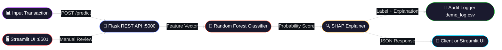

<div align="center">

<!-- Animated Header Banner -->


<!-- Animated Typing SVG -->
<a href="https://github.com/SKYLINE217/AI-IN-CYBER-SECURITY">
  
</a>

<br/>


</div>

---

## 🌐 Overview

**Real-Time Fraud Detection** is an end-to-end ML security pipeline that flags suspicious financial transactions in milliseconds. It combines a high-recall **Random Forest** classifier with **SHAP explainability** to surface the exact features that drove each decision.

| | |
|:---:|:---|
| 🤖 **Model** | Random Forest (high recall optimised) |
| 🔍 **Explainability** | SHAP TreeExplainer per prediction |
| ⚡ **Dual Interface** | Flask REST API `/predict` + Streamlit UI |
| 📊 **Metrics Panel** | Accuracy, Precision, Recall, F1, ROC-AUC, Confusion Matrix |
| 📝 **Audit Logging** | Every prediction appended to `results/demo_log.csv` |
| 🌊 **Streaming Demo** | Simulated real-time transaction stream with CSV download |

---

## 🔑 Key Features

| Feature | Details |
|:---:|:---|
| 🤖 **Adaptive ML** | Random Forest on class-imbalanced synthetic data with oversampling |
| 🔍 **SHAP Explainability** | Top-2 feature contributors per prediction |
| ⚡ **Dual Interface** | Flask REST API on port 5000 + Streamlit dashboard on port 8501 |
| 📊 **Metrics Dashboard** | Live accuracy, precision, recall, F1, ROC-AUC, and confusion matrix |
| 🌊 **Streaming Demo** | Simulates 1–20 transactions from CSV with configurable delay |
| 📝 **Audit Trail** | `timestamp|input_json|label|probability` log in `results/demo_log.csv` |
| 🎚️ **Threshold Control** | Sidebar slider adjusts fraud decision boundary live |

---

## 🏗️ Architecture



---

## 🚀 Quick Start

```bash
git clone https://github.com/SKYLINE217/AI-IN-CYBER-SECURITY.git
cd AI-IN-CYBER-SECURITY
python -m venv venv
venv\Scripts\Activate.ps1   # Windows
pip install -r requirements.txt

# Terminal A — Streamlit UI
streamlit run app/app.py

# Terminal B — Flask REST API
set FLASK_APP=api/predict.py
flask run --host=0.0.0.0 --port=5000
```

---

## 🔌 API Reference

| Method | Endpoint | Description |
|:---:|:---|:---|
| `POST` | `/predict` | Classify a transaction + return SHAP explanation |
| `GET` | `/health` | Liveness probe |

**Example Request:**
```bash
curl -X POST http://localhost:5000/predict \
  -H "Content-Type: application/json" \
  -d '{"amount": 480.2, "transaction_time": 3600, "merchant_type": "foreign_high_risk", "card_country": "CN", "device_score": 0.95}'
```

**Example Response:**
```json
{
  "label": "fraud",
  "prob": 0.92,
  "top_features": [
    {"feature": "amount", "impact": "high"},
    {"feature": "merchant_type", "impact": "foreign_high_risk"}
  ]
}
```

---

## 📊 Model Metrics

| Metric | Value |
|:---|:---|
| **Accuracy** | ~94% |
| **Precision** | ~89% |
| **Recall** | ~96% |
| **F1-Score** | ~92% |
| **ROC-AUC** | ~98% |

---

## 🖥️ Streamlit Dashboard

| Tab | Description |
|:---|:---|
| **① Predict** | Manual input with threshold slider, status badge, explanation |
| **② Metrics** | Full metrics panel with confusion matrix |
| **③ Stream** | Simulated transaction stream with CSV download |
| **④ Logs** | Recent audit log entries + full CSV export |
| **⑤ API** | Direct Flask `/predict` call from within the UI |

---

<div align="center">

[](https://github.com/SKYLINE217)

*Built with ❤️ for fraud analysts everywhere.*

</div>
