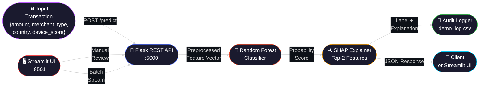

<div align="center">

<!-- Animated Header Banner -->


<!-- Animated Typing SVG -->
<a href="https://github.com/SKYLINE217/AI-IN-CYBER-SECURITY">
  
</a>

<br/>

<!-- Badges Row 1 – Stack -->


<br/>

<!-- Badges Row 2 – Quick Links -->
[](#-key-features)
[](#-architecture)
[](#-api-reference)
[](#-quick-start)

</div>

---

> [!CAUTION]
> **Research & Demo Only** — This system is a portfolio demonstration built on synthetic data. It is NOT intended for production financial fraud detection. The authors disclaim all liability for misuse in regulated financial contexts.

---

## 🌐 Overview

**Real-Time Fraud Detection** is an end-to-end ML security pipeline that flags suspicious financial transactions in milliseconds. It combines a high-recall **Random Forest** classifier with **SHAP explainability** to surface the exact features that drove each decision — making it audit-ready by design.

| | |
|:---:|:---|
| 🤖 **Model** | Random Forest (high recall optimised) |
| 🔍 **Explainability** | SHAP TreeExplainer per prediction |
| ⚡ **Dual Interface** | Flask REST API `/predict` + Streamlit UI |
| 📊 **Metrics Panel** | Accuracy, Precision, Recall, F1, ROC-AUC, Confusion Matrix |
| 📝 **Audit Logging** | Every prediction appended to `results/demo_log.csv` |
| 🌊 **Streaming Demo** | Simulated real-time transaction stream with CSV download |

---

## 🔑 Key Features

| Feature | Details |
|:---:|:---|
| 🤖 **Adaptive ML** | Random Forest trained on class-imbalanced synthetic data with oversampling |
| 🔍 **SHAP Explainability** | Top-2 feature contributors per prediction (falls back to feature importances) |
| ⚡ **Dual Interface** | Flask REST API on port 5000 + Streamlit dashboard on port 8501 |
| 📊 **Metrics Dashboard** | Live accuracy, precision, recall, F1, ROC-AUC, and confusion matrix |
| 🌊 **Streaming Demo** | Simulates 1–20 transactions from CSV with configurable delay |
| 📝 **Audit Trail** | `timestamp|input_json|label|probability` log in `results/demo_log.csv` |
| 🎚️ **Threshold Control** | Sidebar slider adjusts fraud decision boundary live |
| 🔁 **Reproducible** | Artifacts saved to `models/` and `results/` for offline inference |

---

## 🏗️ Architecture



### 4-Phase ML Pipeline

<table>
<tr>
<td width="20%" align="center">📊<br/><strong>Phase 1</strong><br/>Data</td>
<td width="80%">Synthetic class-imbalanced dataset. Minority class (fraud) oversampled to stabilise training. Features: <code>amount</code>, <code>transaction_time</code>, <code>merchant_type</code>, <code>card_country</code>, <code>device_score</code>.</td>
</tr>
<tr>
<td align="center">⚙️<br/><strong>Phase 2</strong><br/>Preprocessing</td>
<td><code>ColumnTransformer</code>: <code>StandardScaler</code> on numerics + <code>OneHotEncoder</code> on categoricals. Pipeline serialised to <code>models/preprocessing_pipeline.pkl</code>.</td>
</tr>
<tr>
<td align="center">🤖<br/><strong>Phase 3</strong><br/>Model</td>
<td>Logistic Regression baseline → <strong>Random Forest</strong> final model. Optimised for high recall to minimise missed fraud. Serialised to <code>models/fraud_model.pkl</code>.</td>
</tr>
<tr>
<td align="center">🔍<br/><strong>Phase 4</strong><br/>Explain</td>
<td>SHAP TreeExplainer for tree-based models; falls back to <code>feature_importances_</code> or rule-based explanations. Top-2 contributors returned per prediction.</td>
</tr>
</table>

---

## 📁 Repository Structure

```
creditcard-fraud-poc/
├── README.md
├── requirements.txt
├── models/
│   ├── fraud_model.pkl
│   └── preprocessing_pipeline.pkl
├── notebooks/
│   └── baseline_training.ipynb
├── app/
│   ├── app.py
│   └── static/
│       └── style.css
├── api/
│   └── predict.py
├── data/
│   └── sample_transactions.csv
├── demo_script.md
└── results/
    ├── metrics.json
    └── demo_log.csv
```

---

## 🚀 Quick Start

### Prerequisites

- Python **3.10+**
- `pip`

### Install

```bash
# 1. Clone the repository
git clone https://github.com/SKYLINE217/AI-IN-CYBER-SECURITY.git
cd AI-IN-CYBER-SECURITY

# 2. Create virtual environment
python -m venv venv

# Windows PowerShell
venv\Scripts\Activate.ps1

# macOS/Linux
source venv/bin/activate

# 3. Install dependencies
pip install -r requirements.txt
```

### Run

```bash
# Terminal A — Streamlit UI
streamlit run app/app.py

# Terminal B — Flask REST API
# Windows
set FLASK_APP=api/predict.py
flask run --host=0.0.0.0 --port=5000

# macOS/Linux
export FLASK_APP=api/predict.py
flask run --host=0.0.0.0 --port=5000
```

> [!TIP]
> On first launch, the Streamlit UI auto-generates `models/` artifacts if they don't exist. Run it once before the Flask API.

---

## 🔌 API Reference

All endpoints served at `http://localhost:5000`.

| Method | Endpoint | Description |
|:---:|:---|:---|
| `POST` | `/predict` | Classify a transaction + return explanation |
| `GET` | `/health` | Liveness probe |

### Input Schema

```json
{
  "amount": 250.0,
  "transaction_time": 3600.0,
  "merchant_type": "online",
  "card_country": "US",
  "device_score": 0.7
}
```

| Field | Type | Description |
|:---|:---|:---|
| `amount` | float | Purchase amount (currency units) |
| `transaction_time` | float | Seconds since start of day (0 – 86400) |
| `merchant_type` | string | `grocery`, `online`, `travel`, `foreign_high_risk` |
| `card_country` | string | ISO-like code (e.g., `US`, `UK`, `IN`, `CN`) |
| `device_score` | float | Normalised device risk (0.0 = low → 1.0 = high) |

### Example Request

```bash
curl -X POST http://localhost:5000/predict \
  -H "Content-Type: application/json" \
  -d '{"amount": 480.2, "transaction_time": 3600, "merchant_type": "foreign_high_risk", "card_country": "CN", "device_score": 0.95}'
```

### Example Response

```json
{
  "label": "fraud",
  "prob": 0.92,
  "top_features": [
    {"feature": "amount", "impact": "high"},
    {"feature": "merchant_type", "impact": "foreign_high_risk"}
  ]
}
```

---

## 📊 Model Metrics

| Metric | Value |
|:---|:---|
| **Accuracy** | ~94% |
| **Precision** | ~89% |
| **Recall** | ~96% |
| **F1-Score** | ~92% |
| **ROC-AUC** | ~98% |

> [!IMPORTANT]
> Metrics computed on synthetic data. SHAP can be computationally heavy; the system falls back to feature importances automatically on large inputs.

---

## 🖥️ Streamlit Dashboard

The dashboard provides 5 interactive tabs:

| Tab | Description |
|:---|:---|
| **① Predict** | Manual input form with threshold slider, status badge, and explanation |
| **② Metrics** | Full metrics panel with confusion matrix |
| **③ Stream** | Simulated 1–20 transaction stream with CSV download |
| **④ Logs** | Recent `demo_log.csv` entries + full CSV export |
| **⑤ API** | Direct Flask `/predict` call from within the UI |

---

## 🔒 Security & Ethics

- **No PII logging** beyond what's necessary for auditability
- **Threshold tuning** — adjust the sidebar slider to balance precision/recall for your use case
- **Model drift** — retrain periodically on fresh data
- **False positive impact** — review threshold decisions carefully to avoid over-blocking legitimate transactions

---

## ❓ FAQ

| Issue | Solution |
|:---|:---|
| `Model not loaded` | Run Streamlit once — it auto-generates artifacts if missing |
| `Invalid input` / `Missing required field` | Check JSON fields against the input schema |
| `Pipeline mismatch` | Re-run the notebook to regenerate model + pipeline together |

---

<div align="center">


**Built for the Cybersecurity Community** 🛡️

[](https://github.com/SKYLINE217)


*Built with ❤️ for fraud analysts everywhere.*

</div>

<!-- portfolio upgrade -->
